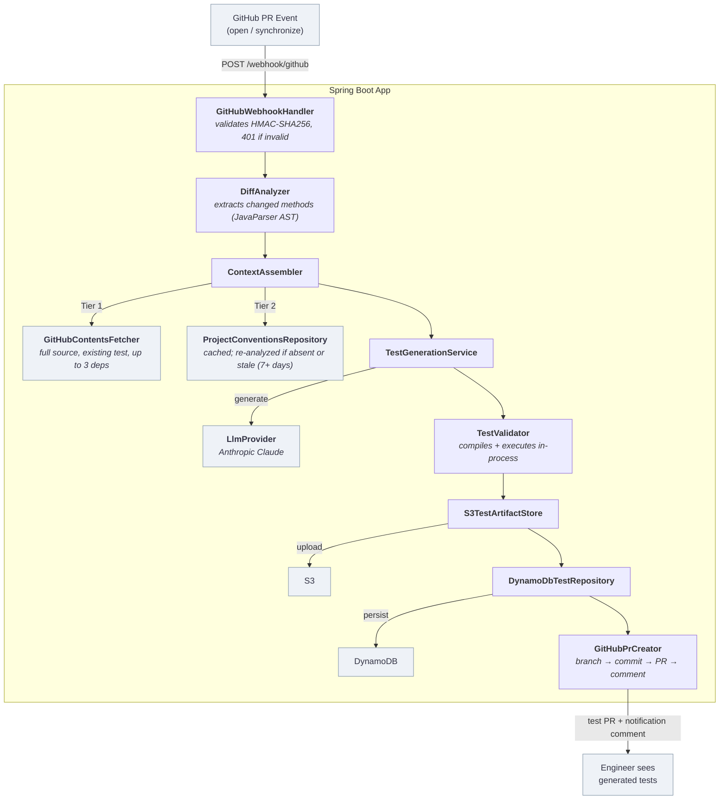

# AI-Powered Test Generation Engine

[](https://github.com/BibinFrancisK/ai-test-generation-engine/actions/workflows/ci.yml)

> Analyzes GitHub PR diffs, generates JUnit 5 tests via Anthropic Claude, validates them in-process, and opens a pull request with the results — automatically.

**Status:** Week 2 complete (v0.2) — full loop working end-to-end: PR opened → diff analysis → LLM test generation → in-process validation → `testgen/` branch + PR opened against the source branch → notification comment. See [`docs/demo-e2e-run.md`](docs/demo-e2e-run.md) for a real run.

---

## What It Does

1. **Receives** a GitHub `pull_request` webhook and validates the HMAC-SHA256 signature
2. **Analyzes** the diff with JavaParser to extract changed methods and assemble a rich generation context (full source, existing test file, project conventions)
3. **Generates** a JUnit 5 test class via LangChain4j + Anthropic Claude, compiles and executes it in-process to validate it
4. **Delivers** the tests by creating a `testgen/{source-branch}-{id}` branch, committing the test file, opening a PR against the source branch, and posting a link comment on the original PR

---

## Architecture



See [`docs/architecture.md`](docs/architecture.md) for the full component breakdown.

---

## How It Works (Week 2 — Current State)

The full pipeline below is implemented, tested, and verified end-to-end against a real GitHub repository (see [`docs/demo-e2e-run.md`](docs/demo-e2e-run.md)).

1. **Receive** — `GitHubWebhookHandler` validates the HMAC-SHA256 signature before deserializing the payload, then ignores anything that isn't a `pull_request` `opened`/`synchronize` event — including events on its own `testgen/` branches, so the engine never recursively generates tests for its own output
2. **Parse & analyze** — `DiffParser` turns the GitHub unified diff into `FileDiff` records; `DiffAnalyzer` uses `SourceAnalyzer` (JavaParser AST) to correlate changed hunk line ranges to method signatures, producing a `List<ChangedMethod>`
3. **Assemble context** — `ContextAssembler` combines Tier 1 (full source, existing test file, up to 3 dependency sources — always fresh from the GitHub Contents API) with Tier 2 (per-repo `ProjectConventions`, cached in DynamoDB and refreshed if stale) into a `GenerationContext`
4. **Generate** — `TestGenerationService` calls the active `LlmProvider` (Anthropic Claude in production; `NoopProvider` in all tests), strips markdown code fences from the response, and extracts the class name via a lookahead regex
5. **Validate** — `TestValidator` compiles the generated test alongside the class-under-test's source using the Java Compiler API, then executes it in-process via the JUnit Platform Launcher, returning a sealed `ValidationResult`
6. **Persist** — the generated test is uploaded to S3 (`S3TestArtifactStore`) and the run recorded in DynamoDB (`DynamoDbTestRepository`)
7. **Deliver** — on successful validation, `GitHubPrCreator` creates a `testgen/{source-branch}-{id}` branch, commits the test file, opens a PR against the source branch, and posts a link comment on the original PR — typically within 20 seconds of the source PR being opened

The active LLM provider is selected at startup via `testgen.llm.provider` in `application.yml` — switching between Anthropic and OpenAI requires only a config change, not a code change (sealed `LlmProvider` interface, ADR-002).

---

## Tech Stack

| Layer | Technology |
|-------|-----------|
| Runtime | Java 21 (virtual threads via Project Loom) |
| Framework | Spring Boot 3.x (`RestClient`, `@ConfigurationProperties` records) |
| LLM | LangChain4j + Anthropic Claude (sealed `LlmProvider` interface) |
| Source analysis | JavaParser (`javaparser-core`) |
| Test generation targets | JUnit 5 + Mockito |
| Persistence | DynamoDB Enhanced Client (metadata) + S3 (test artifacts) |
| Compute | ECS Fargate + Application Load Balancer |
| IaC | Terraform (all AWS resources); LocalStack for local iteration |
| Local dev | Docker Compose v2 (`docker compose up` = LocalStack; `--profile full` adds the app) |
| CI/CD | GitHub Actions (build + test on PR; deploy to ECS on merge to `main`) |

---

## Prerequisites

- **Java 21 LTS** — verify with `java -version`
- **Maven 3.9+** — verify with `mvn -version`
- **Docker Desktop** — required for LocalStack and integration tests
- **AWS CLI v2** — for ECR login and ECS deploy commands
- **Terraform** (latest stable) — for infra provisioning
- **IntelliJ IDEA** (Community or Ultimate)
- **smee.io channel URL** — free webhook proxy for local development; create one at [smee.io](https://smee.io)
- **Anthropic API key** — with a **$10/month hard spend cap** set in the [Anthropic console](https://console.anthropic.com)
- **GitHub App** — installed on your test target repository (configured on Day 12)

---

## Quickstart

```bash
# 1. Copy and fill in your Anthropic API key
cp .env.example .env        # then set LLM_API_KEY=sk-ant-...

# 2. Run all tests (unit + integration; NoopProvider — no API key required)
./mvnw verify

# 3. Run a single test class
./mvnw -Dtest=DiffParserTest test

# 4. Start the app (Week 2: requires LocalStack for DynamoDB/S3)
./mvnw spring-boot:run
```

> **Note:** Docker Compose and LocalStack are added in Week 2 (Day 9). Until then, `./mvnw verify` is the primary dev loop.

---

## Architecture Decision Records

| ADR | Decision |
|-----|---------|
| [ADR-001](docs/adr/ADR-001-compute.md) | ECS Fargate + ALB for compute |
| [ADR-002](docs/adr/ADR-002-llm-provider.md) | Anthropic Claude first, sealed `LlmProvider` interface |
| [ADR-003](docs/adr/ADR-003-test-storage.md) | DynamoDB for metadata, S3 for test artifacts |
| [ADR-004](docs/adr/ADR-004-local-aws.md) | LocalStack for all local AWS iteration |
| [ADR-005](docs/adr/ADR-005-source-analysis.md) | JavaParser for source and convention analysis |
