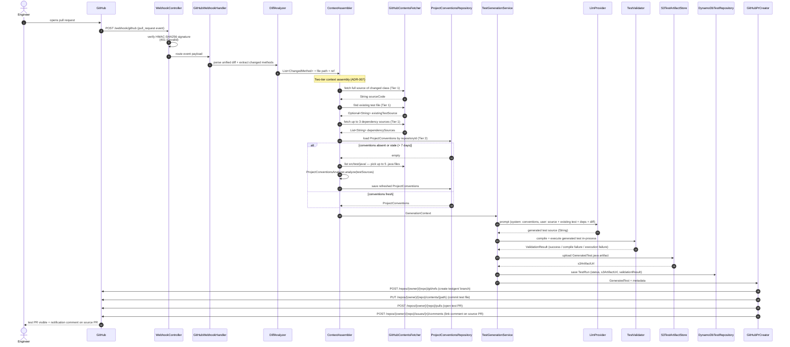

# AI-Powered Test Generation Engine

> Analyzes GitHub PR diffs, generates JUnit 5 tests via Anthropic Claude, validates them in-process, and opens a pull request with the results — automatically.

**Status:** In Progress — Week 1

---

## What It Does

1. **Receives** a GitHub `pull_request` webhook and validates the HMAC-SHA256 signature
2. **Analyzes** the diff with JavaParser to extract changed methods and assemble a rich generation context (full source, existing test file, project conventions)
3. **Generates** a JUnit 5 test class via LangChain4j + Anthropic Claude, compiles and executes it in-process to validate it
4. **Delivers** the tests by creating a `testgen/{source-branch}-{id}` branch, committing the test file, opening a PR against the source branch, and posting a link comment on the original PR

---

## Architecture



See [`docs/architecture.md`](docs/architecture.md) for the full component breakdown.

---

## Tech Stack

| Layer | Technology |
|-------|-----------|
| Runtime | Java 21 (virtual threads via Project Loom) |
| Framework | Spring Boot 3.x (`RestClient`, `@ConfigurationProperties` records) |
| LLM | LangChain4j + Anthropic Claude (sealed `LlmProvider` interface) |
| Source analysis | JavaParser (`javaparser-core`) |
| Test generation targets | JUnit 5 + Mockito |
| Persistence | DynamoDB Enhanced Client (metadata) + S3 (test artifacts) |
| Compute | ECS Fargate + Application Load Balancer |
| IaC | Terraform (all AWS resources); LocalStack for local iteration |
| Local dev | Docker Compose v2 (`docker compose up` = LocalStack; `--profile full` adds the app) |
| CI/CD | GitHub Actions (build + test on PR; deploy to ECS on merge to `main`) |

---

## Prerequisites

- **Java 21 LTS** — verify with `java -version`
- **Maven 3.9+** — verify with `mvn -version`
- **Docker Desktop** — required for LocalStack and integration tests
- **AWS CLI v2** — for ECR login and ECS deploy commands
- **Terraform** (latest stable) — for infra provisioning
- **IntelliJ IDEA** (Community or Ultimate)
- **smee.io channel URL** — free webhook proxy for local development; create one at [smee.io](https://smee.io)
- **Anthropic API key** — with a **$10/month hard spend cap** set in the [Anthropic console](https://console.anthropic.com)
- **GitHub App** — installed on your test target repository (configured on Day 12)

---

## Quickstart

> Coming on Day 2 (Spring Boot scaffold). Steps will be:

```bash
# 1. Copy and fill in secrets
cp .env.example .env

# 2. Start LocalStack (DynamoDB + S3 emulation)
docker compose up -d

# 3. Run all tests
./mvnw verify

# 4. Start the app
./mvnw spring-boot:run
```

---

## Architecture Decision Records

| ADR | Decision |
|-----|---------|
| [ADR-001](docs/adr/ADR-001-compute.md) | ECS Fargate + ALB for compute |
| [ADR-002](docs/adr/ADR-002-llm-provider.md) | Anthropic Claude first, sealed `LlmProvider` interface |
| [ADR-003](docs/adr/ADR-003-test-storage.md) | DynamoDB for metadata, S3 for test artifacts |
| [ADR-004](docs/adr/ADR-004-local-aws.md) | LocalStack for all local AWS iteration |
| [ADR-005](docs/adr/ADR-005-source-analysis.md) | JavaParser for source and convention analysis |
