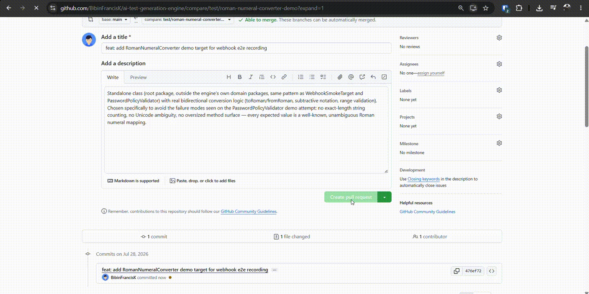
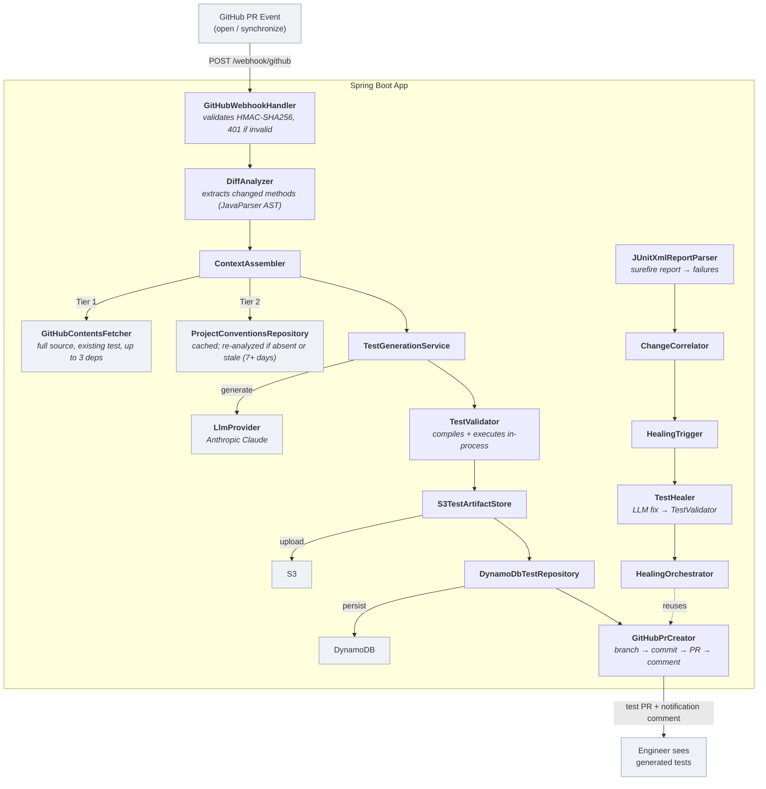

# AI-Powered Test Generation Engine

[](https://github.com/BibinFrancisK/ai-test-generation-engine/actions/workflows/ci.yml)

> Analyzes GitHub PR diffs, generates JUnit 5 tests via Anthropic Claude, validates them in-process, and opens a pull request with the results — automatically. Self-heals tests broken by later code changes.

**Status:** v1.0 — complete. Full generation loop, self-healing, coverage dashboard, and AWS deployment (ECS Fargate + ALB via Terraform) are all implemented and verified end-to-end against a real GitHub repository. See [`docs/demo-e2e-run.md`](docs/demo-e2e-run.md) for a real run.



---

## What It Does

1. **Receives** a GitHub `pull_request` webhook and validates the HMAC-SHA256 signature
2. **Analyzes** the diff with JavaParser to extract changed methods and assemble a rich generation context (full source, existing test file, project conventions)
3. **Generates** a JUnit 5 test class via LangChain4j + Anthropic Claude, compiles and executes it in-process to validate it
4. **Delivers** the tests by creating a `testgen/{source-branch}-{id}` branch, committing the test file, opening a PR against the source branch, and posting a link comment on the original PR
5. **Self-heals** — when a test later breaks due to a code change, `HealingOrchestrator` correlates the failure to its cause, asks the LLM for a fix, validates it, and opens a `testgen/heal-...` PR the same way

---

## Architecture


```mermaid
flowchart TD
    GH["GitHub PR Event<br/>(open / synchronize)"]
    GH -->|"POST /webhook/github"| WH

    subgraph App["Spring Boot App"]
        direction TB
        WH["<b>GitHubWebhookHandler</b><br/><i>validates HMAC-SHA256, 401 if invalid</i>"]
        WH --> DA["<b>DiffAnalyzer</b><br/><i>extracts changed methods (JavaParser AST)</i>"]
        DA --> CA["<b>ContextAssembler</b>"]

        CA -->|"Tier 1"| GCF["<b>GitHubContentsFetcher</b><br/><i>full source, existing test, up to 3 deps</i>"]
        CA -->|"Tier 2"| PCR["<b>ProjectConventionsRepository</b><br/><i>cached; re-analyzed if absent or stale (7+ days)</i>"]
        CA --> TGS["<b>TestGenerationService</b>"]

        TGS -->|"generate"| LLM["<b>LlmProvider</b><br/><i>Anthropic Claude</i>"]
        TGS --> TV["<b>TestValidator</b><br/><i>compiles + executes in-process</i>"]
        TV --> S3S["<b>S3TestArtifactStore</b>"]
        S3S -->|"upload"| S3["S3"]
        S3S --> DDB["<b>DynamoDbTestRepository</b>"]
        DDB -->|"persist"| DYN["DynamoDB"]
        DDB --> GPC["<b>GitHubPrCreator</b><br/><i>branch → commit → PR → comment</i>"]

        JXR["<b>JUnitXmlReportParser</b><br/><i>surefire report → failures</i>"] --> CC["<b>ChangeCorrelator</b>"]
        CC --> HT["<b>HealingTrigger</b>"]
        HT --> TH["<b>TestHealer</b><br/><i>LLM fix → TestValidator</i>"]
        TH --> HO["<b>HealingOrchestrator</b>"]
        HO -.->|"reuses"| GPC
    end

    GPC -->|"test PR + notification comment"| DONE["Engineer sees<br/>generated tests"]

    classDef external fill:#eef2f7,stroke:#8899aa,color:#334;
    class GCF,PCR,LLM,S3,DYN,GH,DONE external;
```

See [`docs/architecture.md`](docs/architecture.md) for the full sequence diagram and component breakdown.

---

## How It Works

The full pipeline below is implemented, tested, and verified end-to-end against a real GitHub repository (see [`docs/demo-e2e-run.md`](docs/demo-e2e-run.md)).

1. **Receive** — `GitHubWebhookHandler` validates the HMAC-SHA256 signature before deserializing the payload, then ignores anything that isn't a `pull_request` `opened`/`synchronize` event — including events on its own `testgen/` branches, so the engine never recursively generates tests for its own output
2. **Parse & analyze** — `DiffParser` turns the GitHub unified diff into `FileDiff` records; `DiffAnalyzer` uses `SourceAnalyzer` (JavaParser AST) to correlate changed hunk line ranges to method signatures, producing a `List<ChangedMethod>`
3. **Assemble context** — `ContextAssembler` combines Tier 1 (full source, existing test file, up to 3 dependency sources — always fresh from the GitHub Contents API) with Tier 2 (per-repo `ProjectConventions`, cached in DynamoDB and refreshed if stale) into a `GenerationContext` (ADR-007)
4. **Generate** — `TestGenerationService` calls the active `LlmProvider` through `LlmSpendGuard` (Anthropic Claude in production; `NoopProvider` in all tests), strips markdown code fences from the response, and extracts the class name via a lookahead regex
5. **Validate** — `TestValidator` compiles the generated test alongside the class-under-test's source using the Java Compiler API, then executes it in-process via the JUnit Platform Launcher, returning a sealed `ValidationResult`
6. **Persist** — the generated test is uploaded to S3 (`S3TestArtifactStore`) and the run recorded in DynamoDB (`DynamoDbTestRepository`)
7. **Deliver** — on successful validation, `GitHubPrCreator` creates a `testgen/{source-branch}-{id}` branch, commits the test file, opens a PR against the source branch, and posts a link comment on the original PR — typically within 20 seconds of the source PR being opened
8. **Self-heal** — `JUnitXmlReportParser` reads a Surefire report for failures, `ChangeCorrelator` maps each failure to the code change that caused it, `TestHealer` asks the LLM for a fix and re-validates it with `TestValidator`, and `HealingOrchestrator` delivers the result via the same `GitHubPrCreator` path (ADR-006)
9. **Track coverage** — `CoverageAggregator` reads persisted `TestRun` data and serves aggregate stats from `GET /api/v1/dashboard`

The active LLM provider is selected at startup via `testgen.llm.provider` in `application.yml` — switching between Anthropic and OpenAI requires only a config change, not a code change (sealed `LlmProvider` interface, ADR-002).

---

## Tech Stack

| Layer | Technology |
|-------|-----------|
| Runtime | Java 21 (virtual threads via Project Loom) |
| Framework | Spring Boot 3.x (`RestClient`, `@ConfigurationProperties` records) |
| LLM | LangChain4j + Anthropic Claude (sealed `LlmProvider` interface) |
| Source analysis | JavaParser (`javaparser-core`) |
| Test generation targets | JUnit 5 + Mockito |
| Persistence | DynamoDB Enhanced Client (metadata) + S3 (test artifacts) |
| Secrets | AWS SSM Parameter Store (`SecureString`), injected via ECS `secrets` + Spring Cloud AWS |
| Compute | ECS Fargate + Application Load Balancer |
| IaC | Terraform (all AWS resources); LocalStack for local iteration |
| Local dev | Docker Compose v2 (`docker compose up` = LocalStack; `--profile full` adds the app) |
| CI/CD | GitHub Actions (build + test on PR; deploy to ECS on merge to `main`) |

---

## Key Design Decisions

- **ECS Fargate + ALB for compute** — production-standard serverless containers with two least-privilege IAM roles (task execution vs. task role); `terraform destroy` tears everything down cleanly ([ADR-001](docs/adr/ADR-001-compute.md))
- **Anthropic Claude behind a sealed `LlmProvider` interface** — swapping providers is a one-line config change (`testgen.llm.provider`), not a code change, and the compiler enforces exhaustive handling of every permitted implementation ([ADR-002](docs/adr/ADR-002-llm-provider.md))
- **DynamoDB for metadata, S3 for test artifacts** — DynamoDB's free tier and schemaless model fit an evolving `TestRun` shape; S3 gives cheap, versioned storage for the generated `.java` files ([ADR-003](docs/adr/ADR-003-test-storage.md))
- **PR-based delivery over review comments** — generated tests are committed to a `testgen/{source-branch}-{id}` branch and proposed via a real, mergeable PR rather than a read-only comment, and self-healing reuses the same delivery path ([ADR-006](docs/adr/ADR-006-pr-based-delivery.md))
- **Two-tier LLM context assembly** — always-fresh per-PR source (Tier 1) combined with a 7-day-cached per-repo conventions profile (Tier 2) gives the LLM both correctness and project-specific style, without the cost of a full-repo snapshot on every request ([ADR-007](docs/adr/ADR-007-two-tier-context.md))

Full list: [ADR-001](docs/adr/ADR-001-compute.md) · [ADR-002](docs/adr/ADR-002-llm-provider.md) · [ADR-003](docs/adr/ADR-003-test-storage.md) · [ADR-004](docs/adr/ADR-004-local-aws.md) · [ADR-005](docs/adr/ADR-005-source-analysis.md) · [ADR-006](docs/adr/ADR-006-pr-based-delivery.md) · [ADR-007](docs/adr/ADR-007-two-tier-context.md)

---

## Local Setup

**Prerequisites:**
- **Java 21 LTS** — verify with `java -version`
- **Maven 3.9+** — verify with `mvn -version` (or use the bundled `./mvnw`)
- **Docker Desktop** — required for LocalStack and integration tests
- **AWS CLI v2** — for ECR login and ECS deploy commands
- **Terraform** (latest stable) — for infra provisioning
- **smee.io channel URL** — free webhook proxy for local development; create one at [smee.io](https://smee.io)
- **Anthropic API key** — with a **$10/month hard spend cap** set in the [Anthropic console](https://console.anthropic.com)
- **GitHub App** — installed on your test target repository

**Steps:**

```bash
# 1. Copy and fill in your Anthropic API key and GitHub App credentials
cp docs/.env.example .env

# 2. Start LocalStack (DynamoDB + S3 emulation)
docker compose up -d

# 3. Provision local infra via Terraform against LocalStack
cd infra/terraform && terraform apply

# 4. Run all tests (unit + integration; NoopProvider — no real LLM calls)
./mvnw verify

# 5. Start the app locally (requires LocalStack running)
./mvnw spring-boot:run

# 6. Point GitHub's webhook at your machine via smee.io, then open a PR
#    in your test target repo to trigger the pipeline end-to-end
```

> Full local environment including the app in one command: `docker compose --profile full up -d`

---

## Deploy

AWS deployment is fully scripted via Terraform (`infra/terraform/`) — ECR, ECS Fargate cluster + service, ALB, DynamoDB, S3, and both IAM roles.

```bash
cd infra/terraform
terraform init
terraform apply     # provisions ECR, ECS, ALB, DynamoDB, S3, IAM — outputs the ALB DNS name

# Build and push the app image, then force a fresh deployment
docker build -t <ecr_repository_url>:latest .
docker push <ecr_repository_url>:latest
aws ecs update-service --cluster <ecs_cluster_name> --service <ecs_service_name> --force-new-deployment

# Tear everything down — always run this after a demo session
terraform destroy -auto-approve
```

Secrets (`LLM_API_KEY`, `GITHUB_APP_PRIVATE_KEY`, `GITHUB_WEBHOOK_SECRET`, `GITHUB_APP_ID`) live in SSM Parameter Store as `SecureString`s and are injected into the ECS task via the native `secrets` block — never as plaintext environment variables, never in source. On merge to `main`, `.github/workflows/deploy.yml` builds the image, pushes to ECR, and forces a new ECS deployment automatically.

---

## Cost

See [`docs/cost-estimate.md`](docs/cost-estimate.md) for the full monthly breakdown. The ALB is the one fixed cost that keeps running even at zero traffic — `terraform destroy -auto-approve` immediately after every demo session returns AWS spend to $0.

---

## What I Learned

See [`docs/what-i-learned.md`](docs/what-i-learned.md) for the write-up on LangChain4j's testability story, sealed interfaces as a Java 21 correctness tool, least-privilege IAM in practice, JavaParser's source-only limitations, and why PR-based delivery beats a comment-only approach.
