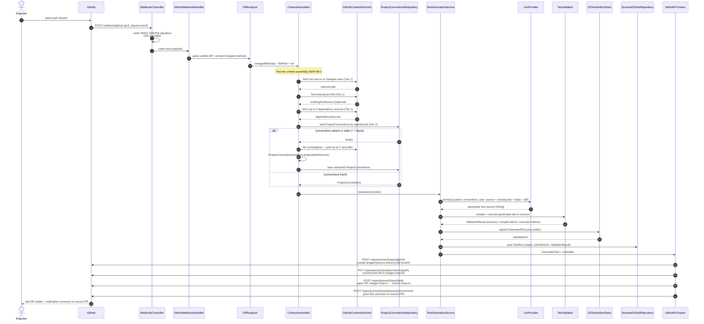

# Architecture — AI-Powered Test Generation Engine

## Happy Path: PR Opened → Test PR Created

The sequence below shows what happens from the moment a developer opens a pull request to the moment a test PR appears in the repository.

---

## Two-Tier Context Assembly (ADR-007)

The quality of generated tests depends entirely on the context given to the LLM. Passing only diff lines produces shallow tests that don't match project conventions or understand class structure.

**Tier 1 — always-fresh code (per PR, via GitHub Contents API):**
- Full source of the changed class — gives the LLM class structure, field types, and method signatures beyond what's in the diff
- Existing test file for that class (if one exists) — the single most valuable input; shows the LLM the project's exact testing style rather than describing it
- Up to 3 dependency source files (parsed from imports, filtered to project-local classes) — gives the LLM context on collaborator types

**Tier 2 — per-repository conventions (DynamoDB, refreshed if > 7 days old):**
- Test framework (`junit5` / `junit4`), mock library (`mockito` / `easymock` / `none`), base test class — detected by `ProjectConventionsAnalyzer` using JavaParser
- Stored in the `project-conventions` DynamoDB table keyed by `repositoryId`
- Regenerated automatically on first use and whenever the cache is stale

`ContextAssembler` coordinates both tiers and returns a single `GenerationContext` record to `TestGenerationService`.

---

## Component Table

| Package | Key Classes | Responsibility |
|---------|------------|----------------|
| `analysis/` | `DiffParser`, `DiffAnalyzer`, `SourceAnalyzer`, `ProjectConventionsAnalyzer` | Parse unified diffs and Java source ASTs |
| `api/` | `TestGenerationController`, `WebhookController`, `DashboardController` | HTTP entry points |
| `config/` | `AppConfig` | Spring `@Bean` wiring only |
| `context/` | `ContextAssembler` | Coordinate Tier 1 + Tier 2 into `GenerationContext` |
| `generation/` | `LlmProvider` (sealed), `AnthropicLlmProvider`, `OpenAiLlmProvider`, `NoopProvider`, `TestGenerationService`, `TestGenerationPromptBuilder` | LLM abstraction and prompt construction |
| `github/` | `WebhookSignatureValidator`, `GitHubWebhookHandler`, `GitHubContentsFetcher`, `GitHubAppAuthenticator`, `GitHubPrCreator` | All GitHub API interactions |
| `healing/` | `JUnitXmlReportParser`, `ChangeCorrelator`, `HealingTrigger`, `TestHealer`, `HealingOrchestrator` | Self-healing broken tests (Days 15–16) |
| `model/` | `ChangedMethod`, `DiffHunk`, `FileDiff`, `GeneratedTest`, `GenerationContext`, `ProjectConventions`, `TestRun`, `ValidationResult`, `HealingResult` | Immutable records and sealed interfaces — no logic |
| `orchestration/` | `TestGenerationOrchestrator` | Pipeline wiring from diff to PR |
| `persistence/` | `DynamoDbTestRepository`, `ProjectConventionsRepository`, `S3TestArtifactStore` | AWS SDK calls |
| `validation/` | `TestCompiler`, `TestExecutor` | In-process compile and run generated tests |
