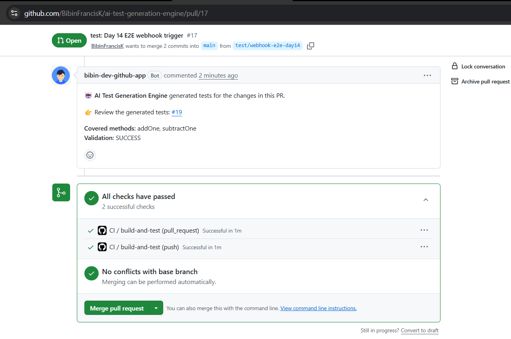
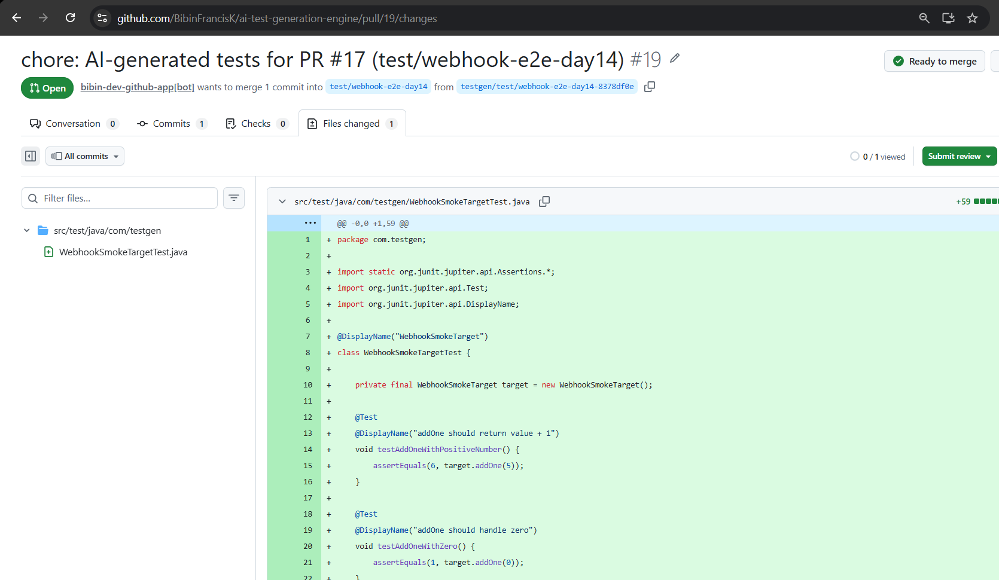

# Real End-to-End Run

This is the evidence from the first real run of the full pipeline against a live GitHub repository — no mocks, no `NoopProvider`: a real webhook delivery, a real Anthropic Claude call, and real GitHub API calls to open a PR.

## The Loop

1. [PR #17](https://github.com/BibinFrancisK/ai-test-generation-engine/pull/17) — a real code change (`WebhookSmokeTarget.addOne`, later `subtractOne`) opened against `main`
2. GitHub fires a `pull_request.opened` (then `synchronize`) webhook → the running engine picks it up
3. The engine analyzes the diff, calls Claude, validates the generated test in-process, uploads it to S3, and opens [PR #19](https://github.com/BibinFrancisK/ai-test-generation-engine/pull/19) (`testgen/test/webhook-e2e-day14-8378df0e` → `test/webhook-e2e-day14`) containing the generated `WebhookSmokeTargetTest.java`
4. It posts a notification comment on PR #17 linking to PR #19

### Source PR notification comment



### Generated test PR — files changed



### Timing

| Run | Source PR opened/pushed | `testgen/` PR + comment posted | Elapsed |
|---|---|---|---|
| First trigger (PR #17 opened, method `addOne`) | `11:06:22Z` | `11:06:40Z` (PR #18) | **18s** |
| Second trigger (pushed `subtractOne` to PR #17) | `11:13:47Z` | `11:14:01Z` (PR #19) | **14s** |

Both runs are well under the 90-second target from the execution plan's Success Criteria #1.

## Bug Found and Fixed During This Run

The first trigger's `testgen/` PR (#18) itself fired a *second* `pull_request.opened` webhook back at the engine — GitHub doesn't distinguish PRs opened by the engine's own GitHub App from PRs opened by a human. `GitHubWebhookHandler` had no guard against this, so the engine recursively tried to generate a test for the generated test file it had just created, and that attempt failed to compile:

```
WARN c.t.o.TestGenerationOrchestrator : Validation failed at COMPILE for testRunId=a68abdab-88a2-4dad-9471-88734dd57338:
[...WebhookSmokeTargetTest.java (line 10): cannot find symbol
  symbol:   class WebhookSmokeTarget
  location: class com.testgen.WebhookSmokeTargetTest, ...]
```

Since `TestGenerationOrchestrator` only opens a delivery PR on `ValidationSuccess`, this recursive run failed silently from GitHub's perspective (no PR, no comment) — but it burned a real LLM call and, in a worse case, could have chained further. Root-caused via the DynamoDB `test-runs` table: two records existed for the same time window, one for `pullRequestId=17` (`SUCCESS`) and one for `pullRequestId=18` (`COMPILE_FAILED`) — the second one *was* the recursive self-trigger.

**Fix:** `GitHubWebhookHandler` now ignores any `pull_request` event whose head branch starts with `testgen/` (`GitHubWebhookHandler.java`, guarded by the new `Constants.TESTGEN_BRANCH_PREFIX`), before ever fetching the diff or dispatching generation. Verified by re-running the trigger a second time (see timing table above) — the resulting `testgen/...` PR (#19) did not trigger a further recursive run across a 60-second watch window, and the engine log below shows the guard firing on that exact webhook.

## Engine Log — Second Trigger, Post-Fix

```
2026-07-19T16:43:53.038+05:30  INFO 4000 --- [ai-test-generation-engine] [omcat-handler-2] c.testgen.github.GitHubAppAuthenticator  : Fetched new GitHub App installation token, valid until 2026-07-19T12:13:53Z
2026-07-19T16:43:58.326+05:30  INFO 4000 --- [ai-test-generation-engine] [omcat-handler-2] c.t.generation.TestGenerationService     : Generated test class WebhookSmokeTargetTest written to tmp\generated-tests\WebhookSmokeTargetTest.java
2026-07-19T16:44:03.875+05:30  INFO 4000 --- [ai-test-generation-engine] [omcat-handler-3] c.testgen.github.GitHubWebhookHandler    : Ignoring pull_request for engine-generated branch=testgen/test/webhook-e2e-day14-8378df0e
```

The first two lines are the successful `synchronize` trigger on PR #17 generating and validating the test that became PR #19. The third line — on a separate handler thread a few seconds later — is the fix: the webhook fired by PR #19's own `opened` event being ignored instead of recursing.
